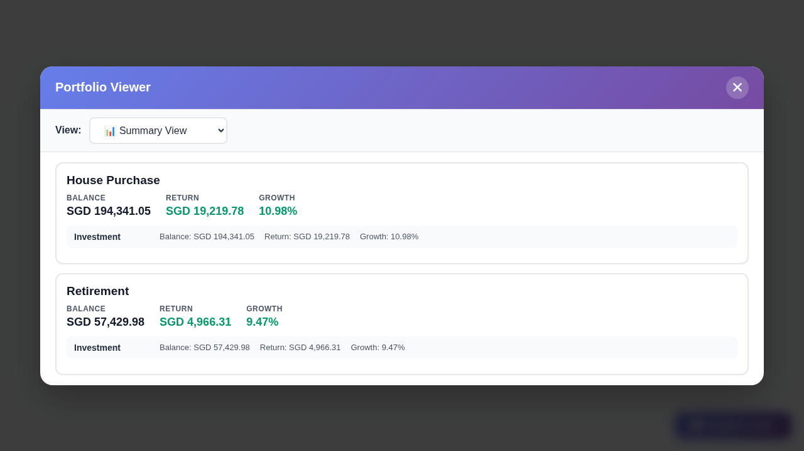

# Goal Portfolio Viewer

## Example Screenshots

### Overview

*Summary view showing House Purchase and Retirement buckets with ending balance, returns, and growth*

### House Purchase Bucket - Performance Graph

*Performance graph showing Total Return % (weighted) with Simple Return %, window returns (1M/6M/YTD/1Y/3Y), TWR %, Annualised IRR, Net Fees, Net Investment, and complete metrics*

### House Purchase Bucket - Goals Table

*Individual goals with target percentages (10%, 70%), diff calculations showing rebalancing needs, cumulative returns, and return percentages*

### Retirement Bucket - Performance Graph

*Retirement bucket showing Total Return % (weighted) with Simple Return %, along with TWR %, IRR, and complete performance metrics*

### Retirement Bucket - Goals Table

*Retirement goals with target allocations (15%, 55%) and diff calculations demonstrating portfolio rebalancing needs*

---

**Track core-satellite portfolios the way they were meant to be seen - clean, goal-aware, and entirely private.**

Investing today often means buying individual funds or managed funds across multiple goals. Most platforms still do not provide an easy way to visualize each of these purchases or track allocation across all of them, whether you follow core-satellite or a broader asset allocation framework. This userscript helps you spot imbalances early and organize everything around your real-life goals.

> **Platform Support**: Currently works with Endowus (Singapore). This userscript enhances your portfolio visualization experience by organizing goals into custom buckets.

---

## Core-Satellite Portfolio Tracking, Done Right

Goal Portfolio Viewer is built for investors who structure their wealth with intention. Whether you run a classic core-satellite strategy or a disciplined asset allocation plan, this userscript turns your portfolio dashboard into a purpose-first view of your portfolio.

It groups your goals by real-life outcomes - retirement, education, emergency funds, or any other life milestone - so you can see how each goal maps to your core and satellite holdings at a glance. Different goals naturally come with different timelines and risk tolerances, and this view helps you reflect those differences in how you allocate your portfolio.

---

## Asset Allocation Frameworks and Core-Satellite Strategies

A strong asset allocation framework makes sure your portfolio matches your time horizon and risk tolerance. Near-term goals often prioritize stability and liquidity, while long-term goals can take on more growth-oriented allocations. Seeing everything by goal makes it easier to keep each allocation aligned with its purpose.

Core-satellite strategies complement this approach. The core anchors each goal with broadly diversified, long-term holdings, while satellites provide focused exposures or tactical tilts. When your goals are grouped clearly, you can spot whether each goal has the right balance between steady core positions and more targeted satellite positions.

---

## Support for Multiple Goals and Allocation Styles

- **Goal-based clarity:** Keep multiple goals organized without spreadsheets or manual rollups.
- **Core + satellite aligned:** See long-term core holdings and tactical satellites side-by-side within each life goal.
- **Asset allocation visibility:** CPF, SRS, and cash investments show together with clear return and growth indicators.
- **Allocation drift:** Set goal targets to surface per-goal-type drift (measured against target amounts) and spot imbalances early.
- **Privacy first:** By default, all data stays on your device and is processed locally in the browser. Optional sync is opt-in and only sends encrypted configuration data.
- **Zero friction:** Use the "Bucket Name - Description" naming pattern in your goal names and the script does the rest.
- **Keyboard-friendly overlay:** Press Esc to close, with focus kept inside the modal while it is open.

---

## Why This View Matters

Endowus and many other platforms already provides excellent low-cost investment options and thoughtfully designed thematic portfolios. The gap is in visualizing your portfolio using a core-satellite approach, especially when you are buying individual funds or managed funds across many goals. When each asset is tracked as its own goal, a multi-goal, core-satellite strategy quickly becomes a long list of goals without a clear allocation view.

This overlay brings those assets back together so more sophisticated retail investors can see how each goal balances core holdings with focused exposures. That means it is easier to track satellite tilts such as China, Tech, or custom thematic portfolios built with FundSmart, while keeping the overall allocation aligned to each life goal.

- **Purpose-led investing:** Every goal is tracked with its own core-satellite balance.
- **Better decisions faster:** Identify imbalances, underweight satellites, or overexposed cores within seconds.
- **Made for Singapore investors:** A clean overlay built around the local workflow and account types.

---

## Get Started in Minutes

1. [Install Tampermonkey](https://www.tampermonkey.net/) for your browser.
2. [Add the Goal Portfolio Viewer Script](https://raw.githubusercontent.com/laurenceputra/goal-portfolio-viewer/main/tampermonkey/goal_portfolio_viewer.user.js).
3. Log in to Endowus. If you see the 📊 button, you're all set.

Bring your core-satellite strategy to life with a view that aligns with how you actually invest.

---

## 🆕 Cross-Device Sync (Optional)

Sync your portfolio configuration across multiple devices with end-to-end encryption.

**Key Features**:
- 🔒 **Zero-Knowledge**: All encryption happens on your device
- 🌐 **Self-Hostable**: Run your own backend on Cloudflare Workers
- 🔄 **Automatic Sync**: Enabled by default after activation with configurable interval, change-based batching, and retry while a sync is in progress
- 🎯 **Conflict Resolution**: Clear UI for handling sync conflicts
- ⚡ **Fast**: ~5ms encryption, global CDN distribution

**Privacy & Opt-In**:
- ✅ Sync is completely optional.
- ✅ No data is sent until you click **Save Settings**.
- ✅ Only encrypted config values are synced, including goal targets and fixed flags.
- ✅ By default, a derived encryption key is stored locally after login or sign up to keep sync unlocked on this device (you can disable remember key or log out to clear it).

**Getting Started**:
1. Review the [Sync Setup Guide](docs/sync-setup.md)
2. Configure your server URL, user ID, and password
3. Login or sign up to enable sync with encryption enabled by default (auto-sync is enabled by default; adjust interval if desired)

**For Self-Hosting**:
- Deploy your own backend: See [workers/README.md](workers/README.md)
- 5-minute setup with Cloudflare Workers (free tier available)

**Technical Details**:
- [Architecture Documentation](SYNC_ARCHITECTURE.md)
- [Integration Guide](tampermonkey/QUICK_START.md)
- [Self-Hosting Guide](workers/README.md)

---

## Contributing

We use a high-ceremony multi-agent workflow to maintain code quality, protect privacy, and keep the userscript, backend, demo, and CI surfaces aligned.

### Quick Start for Contributors

1. **Fork and clone** the repository
2. **Install dependencies**: `pnpm install`
3. **Make changes** following the canonical workflow in [`.agents/agent-instructions.md`](.agents/agent-instructions.md)
4. **Submit or update a PR** using the repository PR template

### Development Workflow

Our project uses specialized agents for different aspects of development:

| Agent | Role | When to Use |
|-------|------|-------------|
| 🎯 **Product Manager** | Requirements & scope | Defining features, clarifying requirements |
| 🔧 **Staff Engineer** | Design, implementation, fixes | Architecture decisions, code changes, review fixes |
| 🧪 **QA Engineer** | Testing & verification | Test plans, verification matrix, regression checks |
| 👁️ **Code Reviewer** | Review gate | Approval, important/blocking findings |
| 😈 **Devil's Advocate** | Risk assessment | Challenging assumptions, finding blind spots |

**Workflow Phases:**
1. **Planning** -> Define requirements and acceptance criteria
2. **Design** -> Propose solution and record tradeoffs
3. **Risk** -> Challenge assumptions and document mitigations
4. **Implementation** -> Make the change
5. **QA** -> Build the verification matrix and record results
6. **Self-Review** -> Inspect the diff and capture evidence
7. **Review** -> Reviewer approves or requests changes
8. **Fix** -> Required whenever review includes any `important` or `blocking` finding
9. **QA -> Self-Review -> Review** repeat after every fix loop

### Required PR Artifacts

Every PR must include:

- Change Brief
- Risks & Tradeoffs
- Acceptance Criteria
- Verification Matrix
- Self-Review Evidence
- Skill Alignment Notes
- Review Response Matrix when review changes are requested

### Development Commands

```bash
pnpm test
pnpm run lint
pnpm run test:watch
pnpm run test:coverage
pnpm run test:e2e
```

`pnpm-lock.yaml` is committed to keep workspace installs reproducible across contributors and CI.

### Documentation

- **[Canonical Agent Instructions](.agents/agent-instructions.md)** - Canonical workflow, stage gates, and required artifacts
- **[GitHub Compatibility Instructions](.github/copilot-instructions.md)** - Compatibility entrypoint for GitHub tooling
- **[Technical Design](TECHNICAL_DESIGN.md)** - Architecture details
- **[Testing Guide](TESTING.md)** - Test strategy and commands
- **[Deployment Guide](DEPLOYMENT.md)** - Workers deployment guidance
- **[Agent Roles](.github/agents/)** - Individual role documentation

### Quality Standards

- ✅ All relevant tests and checks must pass
- ✅ Verification evidence must be newer than the latest fix
- ✅ Financial calculations must be manually verified when behavior changes touch them
- ✅ Documentation must stay aligned with the actual repo structure and commands
- ✅ No unresolved `important` or `blocking` review findings remain
- 🔒 No data egress unless the user explicitly enables sync
- 🔒 No `eval()` or unsafe patterns

---

## License

MIT License - See [LICENSE](LICENSE) for details.
